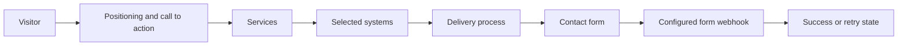

# SYS.ARCHITECT


A dark, conversion-focused portfolio site for an automation and systems consultant. The single-page experience presents services, projects, process, FAQs, and a lead form with animated section reveals and responsive navigation.

## Experience

- floating navigation with smooth section scrolling;
- services and systems-architecture positioning;
- project and process storytelling;
- expandable FAQ content;
- mobile navigation and responsive layouts;
- Make.com-compatible contact submission;
- Intersection Observer-powered reveal animations.

## Visitor flow



## Local development

```bash
npm install
npm run dev
```

Vite prints the local development URL. To verify a production build:

```bash
npm run build
npm run preview
```

## Contact-form configuration

The form endpoint is currently defined in `src/App.jsx`. Replace it with the intended Make.com, Formspree, or custom API endpoint before deployment. For a maintained deployment, move the URL to a Vite environment variable such as `VITE_CONTACT_ENDPOINT` and avoid committing private webhook URLs.

The browser posts JSON containing the visitor's name, email, and message. Confirm the receiving workflow's retention, spam protection, and privacy behavior before collecting real leads.

## Deployment

`npm run build` creates a static `dist/` bundle suitable for Vercel, Netlify, Cloudflare Pages, or any static host. Configure SPA fallback to `index.html` if the host requires it.

## Status

Frontend marketing site. The contact webhook is the only external integration; there is no application backend in this repository.
